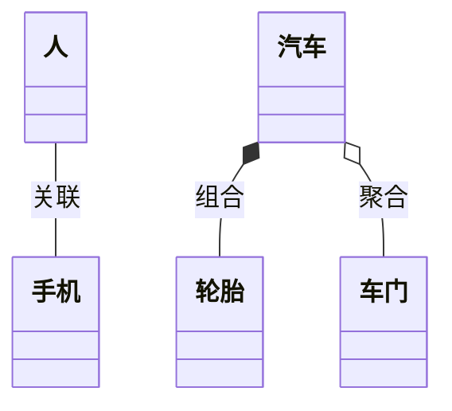


- Hexo Next 主题
  - 支持 Mermaid
  - 支持 markmap 思维导图
  - 全局配置
- 思维导图
  - 可缩放
  - 可拖拽
  - 超美观


# UML 统一建模语言核心知识点解析
## 一、UML 概述
UML 又称**统一建模语言**或**标准建模语言**，是支持模型化和软件系统开发的图形化语言。其作用域覆盖**面向对象的分析与设计**，并延伸至从需求分析开始的**软件开发生命全过程**。

## 二、建模的意义
1.  模型是对现实的简化，核心目的是**更好地理解复杂系统**。
2.  支持按实际场景或需求对系统**可视化**，解决“文字难以描述，画图替代表达”的沟通难题。
3.  可详细说明系统的**结构与行为**，为系统构建提供标准化的构造模板。
4.  对开发决策进行**文档化留存**，遵循“先有文档，后有代码”的开发逻辑。

## 三、UML 的核心特点
1.  **标准统一**：被 OMG 组织采纳为**行业标准建模语言**，通用性极强。
2.  **面向对象**：专门适配面向对象开发模式，贴合主流软件设计思想。
3.  **可视化强**：以图形化形式呈现表达逻辑，直观清晰，降低理解门槛。
4.  **独立于开发过程**：不绑定特定开发模型，可适配瀑布、敏捷、螺旋等**所有软件研发流程**。
5.  **简洁易掌握**：概念明确、表达简洁、结构清晰，学习与应用成本低。

## 四、UML 概念模型核心构成
UML 概念模型由**基本构造块 + 规则 + 公共机制**三部分组成，核心是对软件系统的抽象表达：
### 1. 事物（元素）
模型中最具代表性成分的抽象，是 UML 的核心单元，包含四类核心事物：
- 结构事物：类、接口、用例、构件、节点等（系统的静态骨架）。
- 行为事物：交互、状态机等（系统的动态行为逻辑）。
- 分组事物：包（Package），用于组织和划分模型结构。
- 注释事物：约束、说明等，用于补充解释模型细节。

### 2. 关系
事物之间的联系，是 UML 的“动态纽带”，核心包含四类关系：
- 关联：基础结构化关系，描述事物间的静态连接（如“人与手机”的关联）。
- 聚合：关联的特殊形式，表达**弱整体-部分关系**（部分可独立脱离整体存在，如“轮胎与汽车”）。
- 组合：关联的强化形式，表达**强整体-部分关系**（部分无法脱离整体独立存在，如“心脏与人体”）。
- 泛化：事物间的继承关系（如“子类继承父类”）。
- 依赖：事物间的使用关系（一个事物的变化会影响另一个事物的功能）。

### 3. 图
相关事物与关系的集合，是 UML 模型的可视化呈现形式，分为三大类：
- 结构图：包含类图、对象图、构件图、部署图，用于描述系统**静态结构**。
- 行为图：包含状态机图、活动图，用于描述系统**动态行为**。
- 交互图：包含时序图、通信图，用于描述对象间的**消息交互流程**。

---
### Hexo 发布适配说明
1.  可直接复制上述内容至 Hexo 项目的 `source/_posts` 目录，新建 `.md` 文件粘贴即可发布。
2.  若需优化排版，可补充标题标签（如 `#` 级）、代码块或图片引用，Hexo 会自动渲染为结构化文章。
3.  如需添加 UML 类图、关系图等示例，可在对应章节补充 Mermaid 语法代码块（Hexo 主流主题均支持），示例如下：

