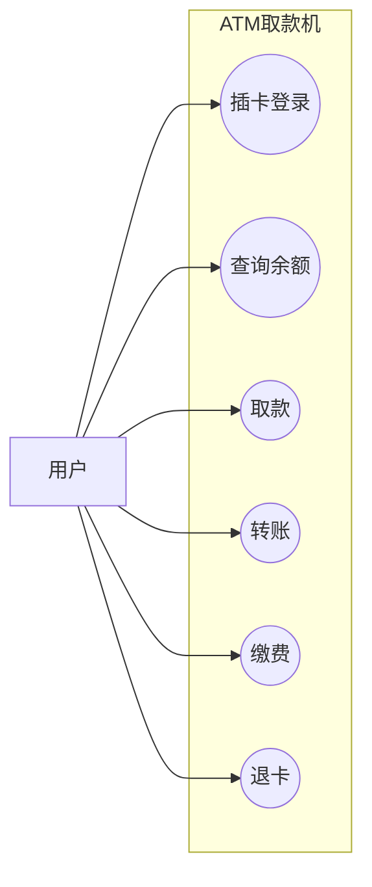

> UML 用例图是软件需求分析中十分常用的工具，它主要用来表示参与者与系统功能之间的联系。本文将围绕用例图的基本元素、各类关系以及实际应用进行介绍，帮助我们快速掌握系统功能与交互逻辑。

<!--more-->

# UML用例图核心知识点总结📊
---
## 一、用例图基础概念
用例图是**需求分析阶段**的可视化工具，用于描述用户、需求与系统功能的关系，帮助开发团队理解外部用户可观察到的系统功能模型。

### 核心模型元素
| 元素 | 定义 | 图形符号 |
|------|------|----------|
| **参与者(Actor)** | 与系统交互的外部实体（用户、组织、外部系统），位于系统边界外 | 小人图标 |
| **用例(Use Case)** | 外部可见的系统功能单元，描述系统提供的服务 | 椭圆图标 |
| **子系统(Subsystem)** | 系统内功能联系紧密的部分功能模块 | 矩形框 |

---
## 二、参与者(Actor)详解
- **本质**：从现实世界抽象的角色，不一定对应具体对象，是与系统交互的**外部实体**。
- **识别角度**：
  1. 为系统提供输入的人/事物
  2. 接收系统输出的人/事物
  3. 需要接入的第三方系统或设备
- **表示**：UML中用**小人符号**表示，下方标注角色名称。

---
## 三、用例(Use Case)详解
- **本质**：类元提供的内聚功能单元，描述系统与参与者的信息交换及执行动作。
- **分类**：
  - **业务用例**：侧重业务操作流程（如“取钱”，描述做什么、怎么做）
  - **系统用例**：侧重与计算机系统的交互，是软件系统设计的核心范围
- **命名规范**：通常为**动宾短语**（如“登录”“查询成绩”），需相对独立且由参与者启动。

---
## 四、用例与参与者的关系
- **关联关系**：参与者与用例之间的交互连接，用**实线**表示，表明参与者会触发该用例。
- **多对多特性**：一个用例可被多个参与者触发，一个参与者也可参与多个用例。

---
## 五、用例之间的核心关系
### 1. 泛化关系（Generalization）
- **定义**：特化用例（子用例）继承一般化用例（父用例）的行为，子用例是父用例的具体实现。
- **表示**：**实线三角箭头**，箭头指向**父用例**。
- **示例**：“订票”（父用例）→“电话订票”“网上订票”（子用例）。

### 2. 包含关系（Include）
- **定义**：基用例包含其他用例的行为，包含用例的行为会插入到基用例中（**必选执行**）。
- **表示**：**虚线箭头**+`<<include>>`，箭头从**基用例**指向**包含用例**。
- **示例**：“创建订单”（基用例）→`<<include>>`→“选择商品”（包含用例）。

### 3. 扩展关系（Extend）
- **定义**：扩展用例在特定条件下增强基用例的行为（**可选执行**），基用例是基础功能。
- **表示**：**虚线箭头**+`<<extend>>`，箭头指向**基用例**。
- **示例**：“查询成绩”（基用例）←`<<extend>>`←“下载成绩”“打印成绩”（扩展用例）。

### 4. 参与者泛化
- 当多个参与者有更一般化的角色时，可建立泛化关系（如“客户”→“直接客户”“电话客户”“网上客户”），箭头指向父参与者。

---
## 六、核心对比速记
| 关系类型 | 执行特性 | 箭头方向 | 关键字 |
|----------|----------|----------|--------|
| 泛化 | 继承关系 | 指向父用例/父参与者 | 无 |
| 包含 | 基用例**必须**执行包含用例 | 基用例→包含用例 | `<<include>>` |
| 扩展 | 基用例**可选**执行扩展用例 | 扩展用例→基用例 | `<<extend>>` |

---
## 七、示例场景解析
以ATM取款机为例：
- **参与者**：用户
- **子系统**：ATM取款机
- **用例**：插卡、查询、存款、取款、转账、退卡
- **关系**：用户与各用例为关联关系，用例之间无包含/扩展，直接并列展示功能。

以学生管理系统为例：
- **参与者**：学生、教师、系统管理员
- **用例**：查询成绩、录入成绩、登录等
- **关系**：“录入成绩”包含“保存成绩”；“查询成绩”可扩展“打印成绩”“下载成绩”；“登录”可扩展“找回密码”。

---
💡 **备考提示**：
- 用例图核心是**识别参与者**和**梳理功能关系**，<mark style="color:red">重点区分 **include**（必选）和 **extend**（可选）。</mark>
- 泛化关系的箭头方向是高频考点，需牢记“箭头指向更一般的一方”。

