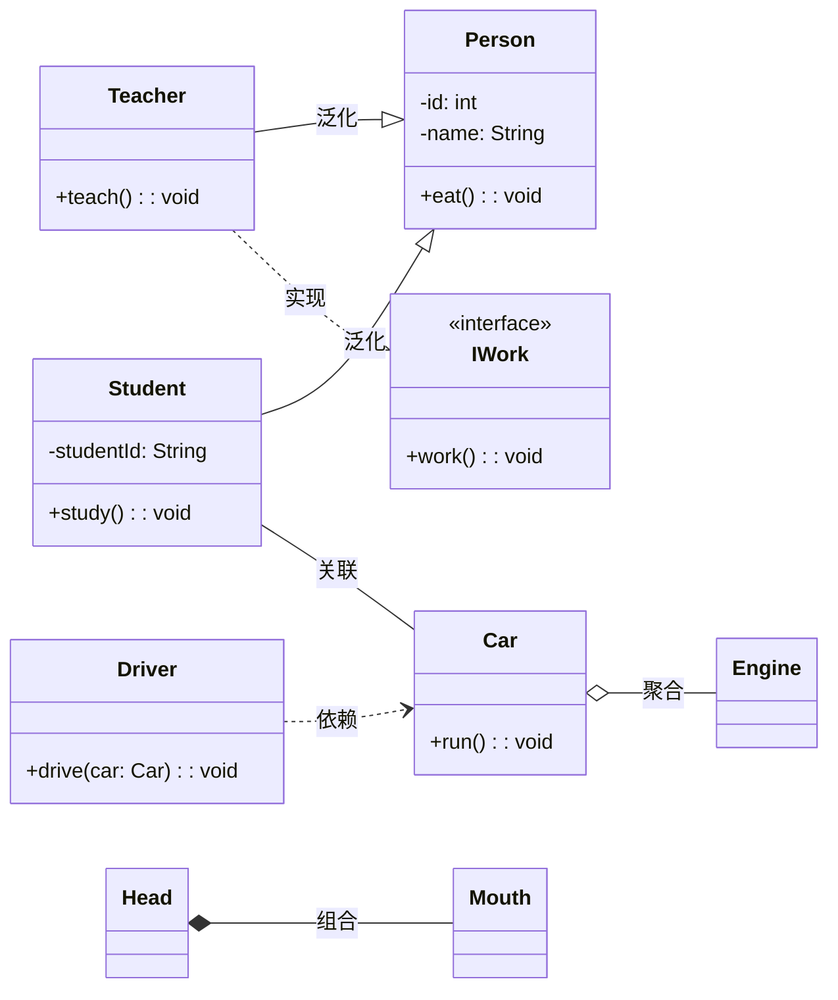

> UML类图通过**类、属性、方法**和**泛化、实现、依赖、关联、聚合、组合**六种关系，清晰描述系统静态结构，是软件分析设计与编码的核心工具。

<!--more-->

# UML类图核心知识点总结📚

## 一、类图基础
类图是软件工程中**静态结构图**，用于描述系统的类集合、类的属性、操作及类间关系，是系统分析、设计、编码与测试的核心模型。

### 类的组成结构
类图从上到下分为三部分：
1.  **类名**（必须存在）
2.  **属性**：每个属性需包含名称，可选信息包括可见性、数据类型、缺省值等
    - 可见性符号：`+`（public）、`-`（private）、`#`（protected）
3.  **操作**：每个操作需包含名称，可选信息包括可见性、参数名/类型、返回值类型等

---

## 二、类间关系与UML表示
类间共有6种核心关系，均为关联/依赖的特例，以下是完整对照：

| 关系类型 | 图形标志 | UML标志 | 核心含义 | 适用场景 |
| :-: | :-: | :-: | :- | :- |
| **依赖** | 虚线箭头 | `---->` | 临时性连接，一个类使用另一个类 | 方法参数、局部变量 |
| **泛化** | 空心三角实线 | `———▷` | 继承关系，子类共享父类特征 | 类继承、抽象类 |
| **实现** | 空心三角虚线 | `---▷` | 类实现接口中的全部方法 | 接口实现 |
| **关联** | 实线直线 | `————` | 长期性连接，持有对象引用 | 学生-课程、人-公司 |
| **聚合** | 空心菱形实线 | `◇———` | 整体与部分，可分离，部分独立存在（弱关联） | 汽车-引擎、班级-学生 |
| **组合** | 实心菱形实线 | `◆———` | 整体与部分，不可分离，生命周期绑定（强关联） | 人-头、公司-部门 |

---

## 三、关键区别与示例
### 1. 聚合 vs 组合
- **聚合**：部分与整体生命周期独立，如汽车报废后，引擎仍可单独使用
- **组合**：部分与整体生命周期绑定，如头不存在时，嘴也不复存在

### 2. 依赖 vs 关联
- **依赖**：临时使用，方法执行完关系即结束，如司机开车时依赖Car类
- **关联**：长期持有，表现为成员变量，如学生对象始终关联多门课程

### 3. 泛化 vs 实现
- **泛化**：类继承类，共享父类属性与方法，如Student继承Person
- **实现**：类实现接口，必须完成接口定义的所有操作，如PenBrush实现IBrush接口

---

## 四、可见性与语法示例
以`借阅者`类为例：
```
借阅者
-借阅证号: int
-是否有借阅资源: boolean
+姓名: string
+类别: string
+性别: string
+借书(): void
+还书(): void
```
- `-借阅证号`：私有属性，仅类内部可访问
- `+姓名`：公共属性，外部可直接访问
- `+借书()`：公共方法，对外提供借书能力

以`Account`类为例：
```
Account
-balance: double = 1
+Deposite(Amount: double): int
+ComputeInterest(): double
```
- `-balance`：私有余额，初始值为1
- `+Deposite()`：公共存款方法，接收double参数，返回int结果
- `+ComputeInterest()`：公共计息方法，返回double结果

---

## 五、类图作用总结
1.  **简化理解**：直观呈现系统静态结构，帮助开发人员快速把握类与类间关系
2.  **阶段产物**：是系统分析与设计阶段的核心输出，指导后续编码与测试
3.  **沟通工具**：作为团队成员间的统一语言，便于需求、设计与实现的对齐

---

