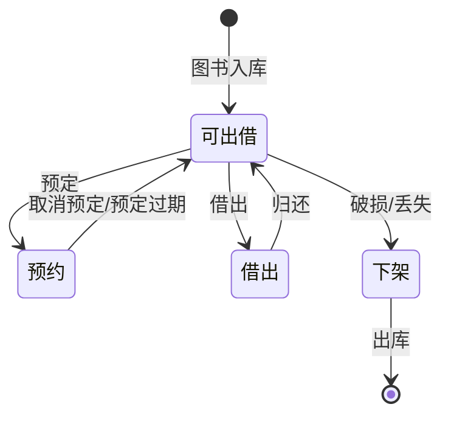

> 状态图是描述单个对象生命周期内所有状态及触发状态转移的事件、动作的 UML 动态视图，通过初态、终态、普通状态与带条件的转移清晰展示对象行为变化。

<!--more-->

# 📌 状态图核心概念
状态图是UML中用于描述**单个对象**在其生命周期内的所有可能状态，以及引发状态转移的事件、动作和活动的动态视图。

- **核心组成**：状态、转移、事件、活动
- **状态分类**：
  - **初态**：对象生命周期的起点，用空心圆表示
  - **终态**：对象生命周期的终点，用实心圆套空心圆表示
  - **普通状态**：对象在生命周期中所处的条件/情况，用圆角矩形表示
- **状态表示**：
  - 简略形式：仅显示状态名称
  - 完整形式：包含状态名称和内部活动

---

# 📌 状态转移语法
状态转移的完整描述格式为：
`源状态 --[触发事件][监护条件]/动作--> 目标状态`

示例：
`Off --[turnOn][有水]/烧水--> On`
- 源状态：`Off`（关闭）
- 触发事件：`turnOn`（打开）
- 监护条件：`有水`（满足条件才会转移）
- 动作：`烧水`（转移时执行的操作）
- 目标状态：`On`（运行）

---

# 📌 状态图建模步骤
1. **确定建模对象**：找出适合用状态图描述行为的类/对象
2. **识别状态**：列出对象所有可能存在的稳定状态
3. **定义事件**：确定会触发状态变化的外部/内部事件
4. **设计转移**：为状态间的变化添加转移条件和执行动作
5. **精化模型**：优化状态粒度、补充细节，确保逻辑完整

---

# 📌 示例解读（图书管理对象）
- **可出借状态**：图书入库后的初始状态
- **预约状态**：被用户预定后进入的状态，可通过“预定”事件触发
- **借出状态**：被用户取走后进入的状态，可通过“借出”事件触发
- **下架状态**：因破损/丢失等原因无法出借，可通过“破损或丢失”事件触发
- **状态转移**：
  - 可出借 → 预约：预定事件
  - 预约 → 可出借：预定过期/取消预定事件
  - 可出借 → 借出：借出事件
  - 借出 → 可出借：归还事件
  - 可出借 → 下架：破损或丢失事件
  - 下架 → 终态：出库事件

---

# 💡 关键特点
- **聚焦单个对象**：只描述一个特定对象的行为，不涉及多个对象交互
- **强调行为结果**：关注对象在不同状态下对事件的响应
- **可视化生命周期**：清晰展示对象从创建到消亡的完整状态变化流程