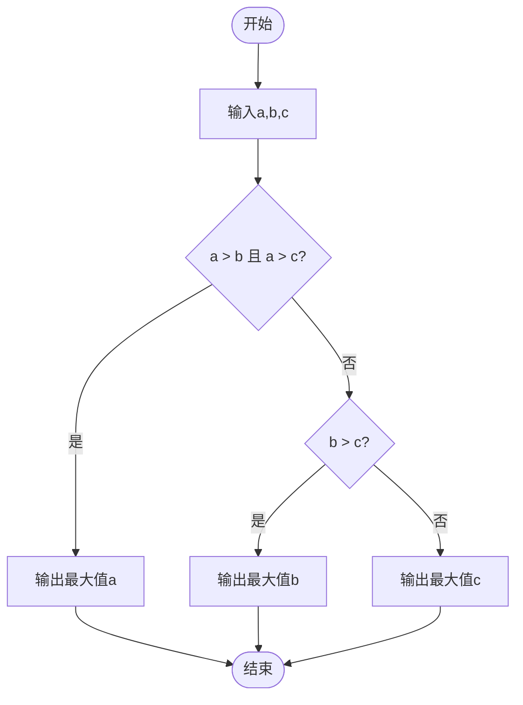
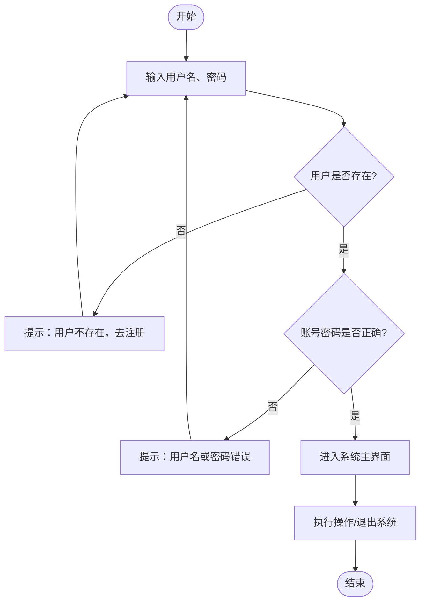

> 本文介绍程序流程图（程序框图）是用图形符号直观描述工作步骤与逻辑顺序的图示方法，涵盖开始 / 结束、处理、输入输出、判断、流向等基础符号及五种基本控制结构，并通过比较三数大小、登录系统实例说明其应用，能清晰表达逻辑、帮助理解。

# 一、流程图基础符号与控制结构 💡
这是程序设计的可视化基础，核心符号与结构如下：

| 符号形状       | 名称         | 作用描述                                                                 |
|----------------|--------------|--------------------------------------------------------------------------|
| 圆角矩形       | 开始/结束标志 | 表示流程的起点或终点，内部写“开始”或“结束”                               |
| 矩形           | 活动/执行标志 | 表示一个具体的处理步骤，内部写操作说明（如“输入a,b,c”“输出a”）             |
| 平行四边形     | 输入/输出标志 | 表示数据的输入或输出操作（如“输入用户名和密码”）                         |
| 菱形           | 判断标志     | 表示条件分支点，内部写判断条件（如“a>b且a>c?”），结果为“是/否”两条路径   |
| 箭头           | 流线标志     | 表示步骤的执行顺序和流程方向                                             |

**五种基本控制结构**：
1.  **顺序型**：步骤按线性顺序依次执行（如“输入→处理→输出”）
2.  **选择型**：根据单一条件判断，选择两条分支之一执行
3.  **先判定型循环（DO-WHILE）**：先判断条件，条件成立则重复执行循环体
4.  **后判定型循环（DO-UNTIL）**：先执行一次循环体，再判断条件是否终止
5.  **多情况选择型（CASE）**：根据一个变量的多个取值，选择对应分支执行

---

# 二、案例1：比较a,b,c大小的流程图 📊
**功能**：输入三个数，输出其中的最大值。
**逻辑步骤**：
1.  开始 → 输入a,b,c
2.  判断 `a>b 且 a>c`：
    -   是 → 输出a
    -   否 → 进入下一步判断
3.  判断 `b>c`：
    -   是 → 输出b
    -   否 → 输出c
4.  结束



**对应代码逻辑（伪代码）**：
```pseudo
input a, b, c
if a > b and a > c:
    print(a)
elif b > c:
    print(b)
else:
    print(c)
```

---

# 三、案例2：登录系统流程图 🔐
**功能**：模拟用户登录验证流程。

**逻辑步骤**：
1.  开始 → 输入用户名和密码
2.  判断“是否存在该用户”：
    -   否 → 提示“用户不存在”并引导注册，跳转回开始状态
    -   是 → 验证用户名和密码
3.  判断“用户名和密码是否正确”：
    -   否 → 提示“用户名或密码错误”，跳转回开始状态
    -   是 → 进入系统主界面
4.  执行相关操作 → 退出系统 → 结束

**核心特点**：
-   包含**循环跳转**：错误时回到“开始”，允许用户重新尝试
-   包含**分支选择**：根据用户存在性、密码正确性分路径处理
-   符合实际登录系统的交互逻辑

---

# 四、流程图设计核心原则 ✅
1.  **清晰性**：每个步骤只做一件事，判断条件明确无歧义
2.  **完整性**：覆盖所有可能的分支情况（如登录失败、无最大值等边界）
3.  **可读性**：箭头方向统一，符号使用规范，便于他人理解
4.  **可执行性**：能直接转化为代码或实际操作步骤

---