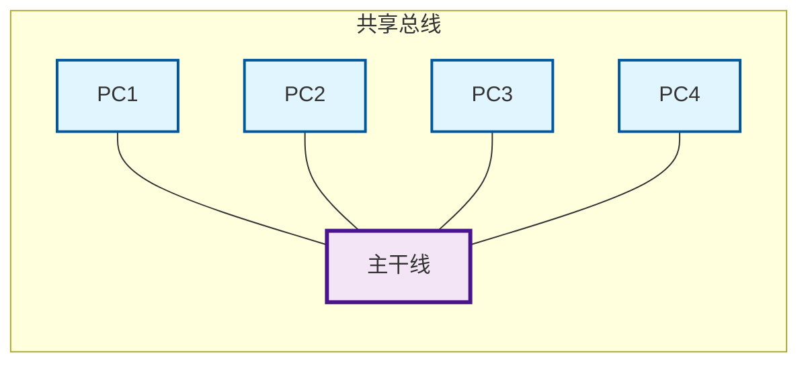
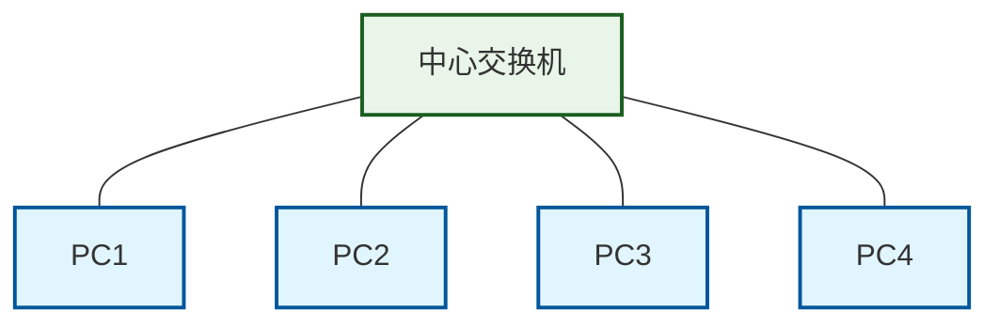
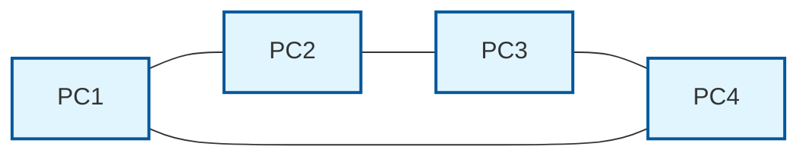
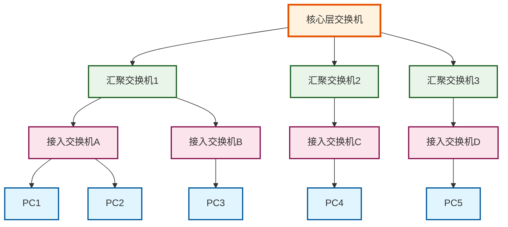
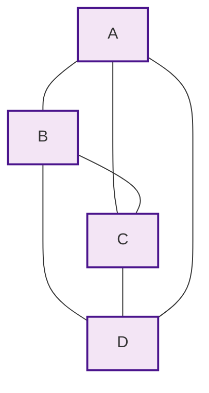
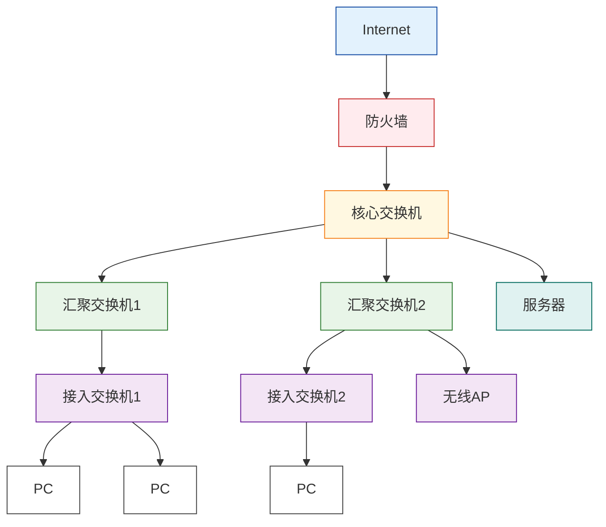

> 💡 备考小贴士
> - **以太网**是局域网最主流技术，核心是**CSMA/CD**介质访问控制。
> - **星型拓扑**是当前局域网最常用结构，核心设备为**交换机**。
> - **网状拓扑**可靠性最高，主要用于**广域网骨干**和**数据中心**等对可用性要求极高的场景。
> - **三层架构**核心是“核心高速转发、汇聚策略控制、接入终端管理”，考试中常考各层功能与设备选型。
> - **WLAN**重点是AC部署模式与无线安全配置，旁挂式是企业网主流选择。
> - **安全设备**需记住：防火墙是边界隔离，IDS是被动监测，IPS是主动防御，网闸是物理隔离。

<!--more-->

# 基础概念
## 📌 一、网络基础概念速览
### 1. 局域网（LAN）
- **定义**：在相对较小的地理范围（通常≤10公里）内，将计算机、外部设备、数据库等通过物理层介质连接，实现资源和信息共享的计算机互联网络。
- **典型场景**：办公室、校园、家庭网络。

### 2. 广域网（WAN）
- **定义**：覆盖范围极广的长距离网络，可跨越多个城市、国家甚至全球，通过传输技术将不同地区的局域网/城域网连接，实现远程通信和数据传输。
- **典型场景**：互联网骨干网、跨地域企业专线。

### 3. 互联网（Internet）
- **定义**：全球性计算机网络，基于TCP/IP协议运行，是开放、共享、自由的网络环境，可在任何地点获取信息。

### 4. 以太网（Ethernet）
- **定义**：采用CSMA/CD介质访问控制方法的共享总线型局域网技术，符合IEEE 802.3标准，是目前使用最广泛的局域网技术。

---

## 📌 二、网络设备符号速查
| 设备类型 | 符号特征 | 备注 |
|----------|----------|------|
| 路由器 | 圆形交叉箭头图标 | 实现不同网络间的路由转发 |
| 无线路由器 | 带天线的路由器图标 | 支持无线接入 |
| 带防火墙的路由器 | 带过滤标识的路由器图标 | 集成安全过滤功能 |
| 交换机 | 方形交叉箭头/多端口图标 | 局域网内数据交换 |
| 三层交换机 | 带太阳标识的交换机图标 | 支持三层路由功能 |
| 防火墙 | 砖墙/斜纹矩形图标 | 网络访问控制与安全防护 |
| 入侵防御/检测 | 盾牌/眼睛图标 | 分别对应IPS/IDS功能 |

---

## 📌 三、网络拓扑结构详解

```mermaid
flowchart LR
    subgraph 网络设备考试标准图例
        Internet[互联网]
        FW[防火墙]
        Router[路由器]
        Core[核心交换机]
        Agg[汇聚交换机]
        Acc[接入交换机]
        AP[无线AP]
        PC[终端PC]
        Server[服务器]
    end

    %% 考试官方配色 + 样式
    classDef internet fill:#e3f2fd,stroke:#0d47a1,stroke-width:2px
    classDef fw fill:#ffebee,stroke:#c62828,stroke-width:2px
    classDef router fill:#fff3e0,stroke:#e65100,stroke-width:2px
    classDef core fill:#fff8e1,stroke:#f57f17,stroke-width:2px
    classDef agg fill:#e8f5e8,stroke:#2e7d32,stroke-width:2px
    classDef acc fill:#f3e5f5,stroke:#6a1b9a,stroke-width:2px
    classDef ap fill:#fce4ec,stroke:#880e4f,stroke-width:2px
    classDef pc fill:#ffffff,stroke:#424242,stroke-width:2px
    classDef server fill:#e0f2f1,stroke:#00695c,stroke-width:2px

    class Internet internet
    class FW fw
    class Router router
    class Core core
    class Agg agg
    class Acc acc
    class AP ap
    class PC pc
    class Server server
```

### 1. 总线型
- **结构**：所有设备共享一条传输介质（如同轴电缆、双绞线）。
- **协议**：IEEE 802.3（CSMA/CD）。
- **优点**：布线容易、成本低、易扩展、线路利用率高。
- **缺点**：带宽受限、安全性差、故障诊断困难，总线故障会导致全网瘫痪。
- **代表**：早期以太网。
- **图示**：

### 2. 星型
- **结构**：所有设备通过中心节点（交换机/集线器）连接。
- **优点**：易于管理、可靠性高、故障诊断和扩展方便。
- **缺点**：中心依赖，主节点负载过重会导致全网故障。
- **代表**：现代以太网、中小型办公网络。
- **图示**：

### 3. 环型
- **结构**：节点连接成闭环，数据沿固定方向传输。
- **协议**：令牌环网（Token Ring）。
- **优点**：信息传输路径唯一、电缆长度短。
- **缺点**：单点故障会导致全网瘫痪、可靠性差。
- **代表**：光纤分布式数据接口（FDDI）。
- **图示**：

### 4. 树型
- **结构**：层次化结构，由多个星型拓扑连接到主干线路，形成“核心-汇聚-接入”三层架构。
- **优点**：扩展性好、管理分层、故障隔离方便。
- **缺点**：根节点故障影响全局、布线复杂。
- **代表**：大型企业局域网、多部门组织结构。
- **图示**：

### 5. 网状型
- **结构**：节点间连接任意，每个节点可与多个其他节点直接相连，又称无规则结构。
- **优点**：可靠性极高、易于扩展、数据传输有多条冗余路径。
- **缺点**：结构复杂、线路成本高、管理维护困难。
- **代表**：互联网骨干网、数据中心核心网络。
- **图示**：

### 🔥 考试标准企业三层网络拓扑

---

## 📌 四、拓扑结构对比表
| 拓扑结构 | 核心特点 | 优点 | 缺点 | 典型应用 |
|----------|----------|------|------|----------|
| 总线型 | 共享一条传输介质 | 成本低、布线简单 | 可靠性差、故障诊断难 | 早期以太网、小型临时网络 |
| 星型 | 中心节点连接所有设备 | 易管理、故障隔离方便 | 中心节点依赖 | 现代以太网、校园网络 |
| 环型 | 闭合环路、单向传输 | 路径唯一、电缆短 | 单点故障致全网瘫痪 | FDDI、光纤分布式网络 |
| 树型 | 层次化“核心-汇聚-接入” | 扩展性好、分层管理 | 根节点故障影响全局 | 大型企业网、多部门组织 |
| 网状型 | 节点间任意连接 | 超高可靠性、多冗余路径 | 成本高、管理复杂 | 互联网骨干网、数据中心 |

---

# 相关应用
## 📌 一、三层网络结构核心知识
### 1. 三层架构功能与设备
| 层级 | 核心功能 | 设备要求 | 设计原则 |
|------|----------|----------|----------|
| **核心层** | 高速数据交换（跨子网骨干流量） | 高端三层交换机 万兆/100G端口 冗余电源/引擎 | 高速转发，禁用复杂策略 高可靠性：设备/链路全冗余 最小化延迟 |
| **汇聚层** | 策略控制与区域聚合 | 中高端三层交换机 多千兆上联 支持OSPF | VLAN路由：终结接入层VLAN 策略实施：ACL、QoS、安全域 路由汇总：减小核心层路由表 |
| **接入层** | 终端接入与管理 | 二层PoE交换机/Wi-Fi AP 高端口密度 低成本 | 端口安全：MAC绑定/802.1X VLAN划分：按部门隔离 PoE供电：AP/IP电话 |

### 2. 三层拓扑图示
- **核心层**：双核心三层交换机，实现链路/设备冗余，连接互联网与各汇聚层。
- **汇聚层**：三层交换机，负责流量聚合、VLAN终结与策略控制。
- **接入层**：交换机/AP，直接面向用户终端，提供接入与带宽分配。

---

## 📌 二、无线局域网（WLAN）核心知识
### 1. 核心设备与标准
- **AP（无线接入点）**：发射无线信号，为终端提供接入接口，通过有线连接到核心网络。
- **AC（无线控制器）**：集中管理所有AP，统一配置SSID、加密、带宽限制，实现AP间无缝漫游。
- **标准**：IEEE 802.11系列（a/b/g/n/ac/ax）。

### 2. AC部署模式
- **串联（直连式）**：AC、AP与上层网络串联，所有数据必须通过AC到达上层网络，AC承担全部控制与数据汇聚功能。
- **旁挂式**：AC旁挂在AP与上层网络的直连交换机上，不直接连接AP，AP业务数据可不经AC直接到达上层网络，更适合大流量场景。

### 3. 基础配置
- **SSID**：无线网络名称，建议唯一且易于识别。
- **频段**：2.4GHz（覆盖广、穿墙强）与5GHz（速度快、干扰少）双频优选。
- **加密**：推荐WPA2-Personal（AES）或WPA3，设置强密码（字母+数字+符号组合）。

---

## 📌 三、有线/无线局域网配置对比
| 特性 | 有线局域网 | 无线局域网 |
|------|------------|------------|
| 传输介质 | 网线（双绞线/光纤） | 无线电波 |
| 连接方式 | 物理端口，稳定、点对点 | 易受环境/干扰影响，广播式 |
| 性能 | 高速、稳定、低延迟 | 延迟较高，受距离/干扰影响 |
| 协议 | IEEE 802.3 | IEEE 802.11 |
| 配置关键 | 交换机VLAN、端口 | SSID、加密、信道、频段 |

### 基本配置步骤
- **有线**：物理连接 → 自动获取IP（DHCP推荐）→ 手动设置静态IP（服务器等设备）。
- **无线**：连接Web管理界面 → 登录默认Wi-Fi → 配置SSID/密码/加密 → 信道/频段优化。

---

## 📌 四、网络安全设备部署与功能
### 1. 设备选型与位置
- **安全设备1（互联网入口）**：**防火墙/包过滤路由器** → 实现内外网边界访问控制，隔离办公网与互联网。
- **安全设备2（服务器区前端）**：**入侵检测系统（IDS）/流量探针** → 被动监测服务器区流量，发现攻击行为但不直接阻断。
- **安全设备3（核心交换旁挂）**：**入侵防御系统（IPS）/WAF** → 主动监测并阻断网络攻击，保护核心业务。

### 2. IPS主要功能
- 实时监测网络中的攻击行为（如DDoS、SQL注入、端口扫描）。
- 主动阻断攻击流量，防止攻击扩散到内部网络。
- 提供攻击日志与告警，便于事后溯源与分析。

### 3. 部署不足
- **单点故障**：核心层/安全设备未做冗余，一旦设备故障会导致全网业务中断。
- **性能瓶颈**：串联模式下AC/防火墙可能成为流量瓶颈，大流量场景下建议旁挂或集群部署。

---

## 📌 五、案例拓扑设备补充（某单位网络）
根据拓扑与需求（物理隔离、三层交换机、并发与流量控制），设备1~8对应如下：
1.  **接入层交换机**（家属区终端接入）
2.  **IPv6路由器**（连接IPv6网络）
3.  **并发与流量控制器**（限制互联网访问带宽与并发数）
4.  **核心交换机**（全网高速交换核心）
5.  **网闸**（实现服务器群与外部网络物理隔离）
6.  **AP控制器（AC）**（集中管理无线AP）
7.  **汇聚交换机**（办公楼/无线区域流量聚合）
8.  **防火墙**（互联网边界安全防护）

---