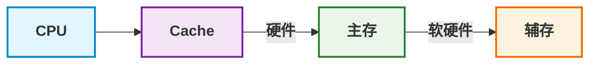

> 本文系统梳理了计算机硬件中存储器层次结构、外存设备、主板核心组件、Cache原理及存储容量计算等核心知识点，总结了关键特性、性能指标与易错考点，便于快速复习备考。

<!--more-->

---

# 🖥️ 计算机硬件核心知识点速记

## 一、存储器层次结构
### 1. 分类与特性
| 类别 | 与CPU关系 | 速度 | 容量 | 易失性 | 代表类型 |
| :--- | :--- | :--- | :--- | :--- | :--- |
| **高速缓存(Cache)** | 与CPU直接交互 | 极快 | 极小 | 易失 | SRAM |
| **主存(内存)** | CPU可直接寻址 | 快 | 中等 | 易失(DRAM)/非易失(SRAM) | DDR4/DDR5, SRAM |
| **辅存(外存)** | 需经I/O调入内存 | 慢 | 极大 | 非易失 | HDD, SSD, 光盘, U盘 |

### 2. 内存细分
- **RAM (随机存取)**：<mark>断电丢失数据，可随机读写</mark>
  - DRAM：需定期刷新，速度较慢、价格低（主流内存）
  - SRAM：无需刷新，速度极快、价格高（用于Cache）
- **ROM (只读存储)**：<mark>断电不丢失数据，早期只读</mark>
  - 演进：PROM → EPROM → EEPROM → Flash（U盘/SSD使用）
  - 用途：存储BIOS等基础程序

### 3. 三级存储结构
`Cache → 主存 → 辅存`
- 解决CPU与主存速度不匹配（Cache层）
- 解决存储系统容量与成本矛盾（辅存层）

---

## 二、外存设备详解
### 1. 硬盘
- **基本单位**：<mark>通常每个扇区为512字节</mark>
- **地址结构**：3D寻址 ——> 柱面号、扇区号、磁头号
- **接口**：IDE、SCSI、光纤通道、SATA（150MB/s～300MB/s）
- **性能指标**：
  - 平均访问时间 = 平均寻道时间 + 平均等待时间
  - 数据传输速率：外部速率（主机与硬盘接口）/ 内部速率（盘片与接口）
- **注意事项**：
  - 防止高温、潮湿和磁场的影响等

### 2. 光盘
- **类型**：CD-ROM(600-700MB)、DVD-ROM(4.7GB)、可擦写光盘
- **原理**：利用激光读取盘片凹坑（凹坑=1，平坦=0）
- **接口**：IDE（内置）、USB（外置）

### 3. 固态硬盘(SSD)
- **存储介质**：Flash芯片（无机械部件）
- **核心优势**：读写速度快、防震抗摔、低功耗、无噪音、工作温度范围广
- **对比机械硬盘**：体积小、重量轻、可靠性高，但同容量价格更高

### 4. U盘
- **本质**：基于Flash的USB存储设备
- **优势**：即插即用、热插拔、小巧便携、标准统一
- **扩展**：USB Hub可级联设备，单台电脑最多连127个USB设备

---

## 三、主板核心组件
### 1. BIOS与CMOS
- **BIOS**：<mark>基本输入输出系统，存于**非易失性ROM**</mark>
  - 功能：POST加电自检、CMOS设置、驱动加载、系统引导
- **CMOS**：可读写RAM芯片，靠主板电池供电
  - 功能：<mark>存储硬件配置信息（日期、硬盘参数、开机密码等）</mark>
  - 区别：<mark>BIOS是程序，CMOS是程序配置的数据存储区</mark>

### 2. 芯片组
- **定义**：主板核心枢纽，连接CPU、内存、硬盘等设备
- **传统组成**：
  - 北桥(MCH)：负责高速通信（内存、显卡）
  - 南桥(ICH)：负责I/O控制（硬盘、USB、PCI等）
- **现代演进**：单芯片设计（如PCH），整合北桥功能

### 3. 总线
- **系统总线三类**：
  - 数据总线：CPU与内存间传输数据（双向，宽度决定一次传输位数）
  - 地址总线：传输内存/IO地址（单向，根数决定寻址空间）
  - 控制总线：传输读写/中断等控制信号（双向）
- **总线带宽公式**：
  - $\text{总线带宽(MB/s)} = \frac{\text{数据线宽度(bit)}}{8} \times \text{总线频率(MHz)} \times \text{每周期传输次数}$

---

## 四、存储容量计算
### 核心公式
- **按位计算**：存储容量 = 存储单元数 × 存储字长(bit)
- **按字节计算**：
$
\text{存储容量} = \text{存储单元数} \times \frac{\text{存储字长(bit)}}{8}
$

### 示例
- 机器字长32位 → 寻址空间64KB
- 20根地址线、16根数据线 → 容量：
$
\text{容量} = 2^{20} \times \frac{16}{8} = 2^{21} = 2 \ \text{MB}
$

---

## 五、Cache核心原理
### 1. 性能分析
- **命中率(H)**：CPU访问数据在Cache中的概率
- **平均访问时间**：
  $
  t = t_c \times H + t_m \times (1-H)
  $
  其中 $t_c$ 是Cache访问时间，$t_m$ 是主存访问时间
- **示例**：Cache速度是主存5倍，命中率95% → 平均访问时间为 **1.2 个单位**，远小于单独访问主存的 5 个单位时间，性能显著提升。
  > 计算过程：
  > 设 Cache 访问时间 $t_c=1$，则主存访问时间 $t_m=5$（Cache 快 5 倍），命中率 $H=0.95$
  > $
    \begin{aligned}
    t &= t_c \times H + t_m \times (1-H) \\
    &= 1 \times 0.95 + 5 \times 0.05 \\
    &= 0.95 + 0.25 \\
    &= 1.2
    \end{aligned}
    $

### 2. 映射方式
| 方式 | 特点 | 灵活性 | 复杂度 |
| :--- | :--- | :--- | :--- |
| **全相联** | 主存块可放任意Cache块 | 最高 | 最高 |
| **直接相联** | 主存块固定映射到唯一Cache块 | 最低 | 最低 |
| **组相联** | 主存块映射到固定组内任意位置 | 中等 | 中等 |

### 3. 替换算法
1. **随机(RAND)**：无策略，随机替换
2. **先进先出(FIFO)**：替换最早调入的块
3. **最近最少使用(LRU)**：替换最久未访问的块（性能最优）
4. **最不经常使用(LFU)**：替换访问次数最少的块

### 4. 一致性问题
- **写策略**：保证Cache与主存数据一致
  - 写直达(Write-through)：同时写Cache和主存
  - 写回(Write-back)：仅写Cache，数据块替换时才写回主存

---

## 六、关键易错点总结
1. ⚠️ **RAM易失，ROM非易失**：Flash属于ROM演进，可读写且断电保存
2. ⚠️ **Cache是SRAM**：速度极快但容量极小，仅缓存高频数据
3. ⚠️ **BIOS在ROM，CMOS在RAM**：CMOS断电后靠电池保存数据
4. ⚠️ **磁盘最小读写单位是扇区**（512字节），而非磁道或字节
5. ⚠️ **Cache映射方式**：直接相联最简单，组相联是实际工程主流选择

---